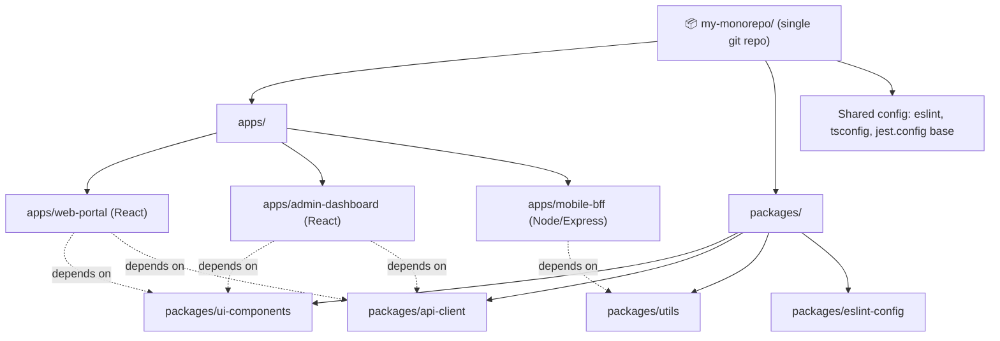
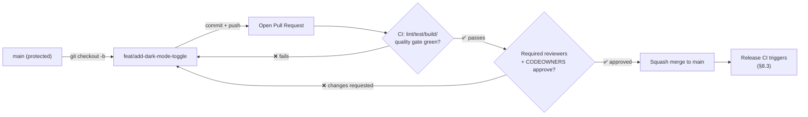
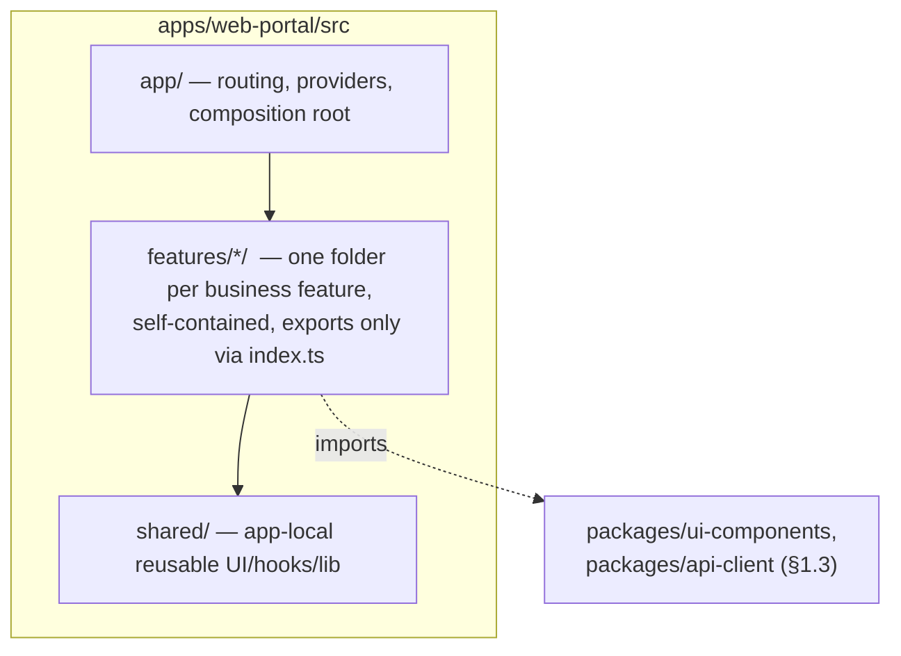
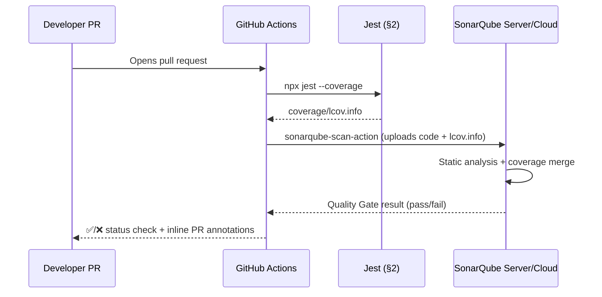
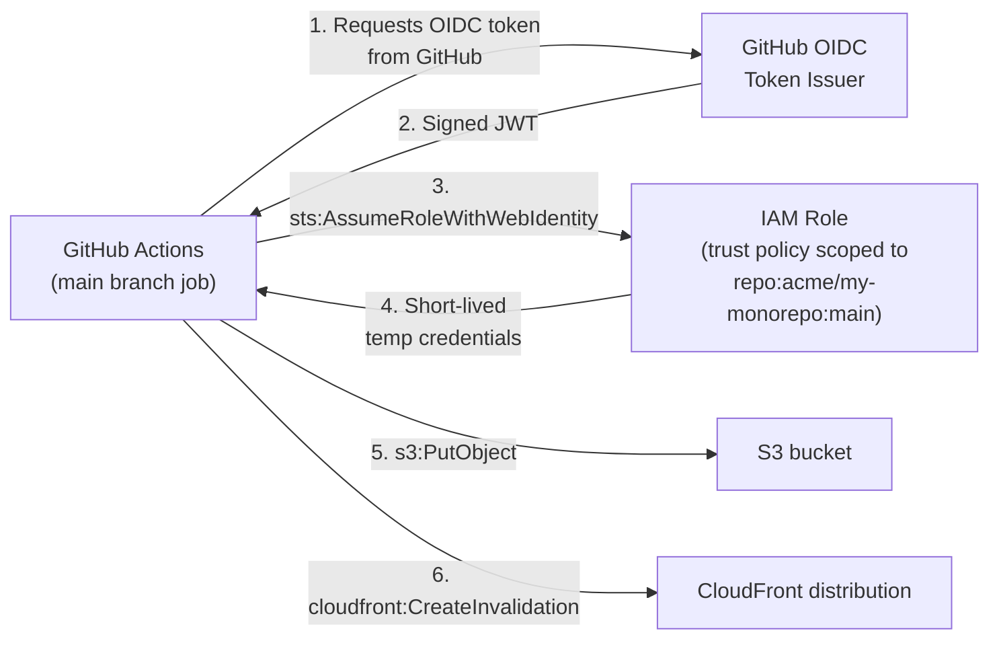
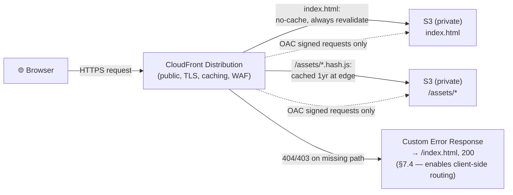
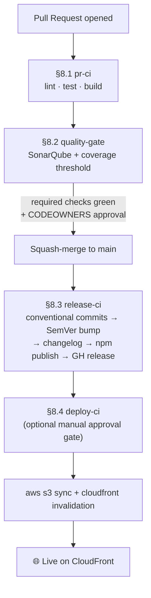
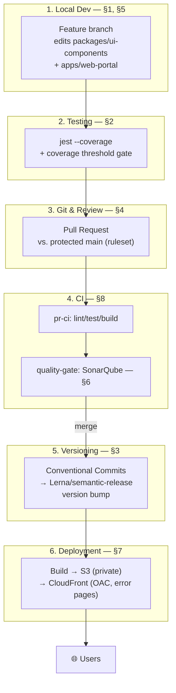

# 🏗️ Enterprise Monorepo, Testing & DevOps Mastery Guide

       

> A soup-to-nuts reference for setting up a production-grade JavaScript/TypeScript monorepo — from package architecture to automated releases, code quality gates, and AWS deployment. Every section includes working config, real commands, official documentation links, and diagrams.

**Last verified:** July 2026 — tool names/versions below (e.g. Lerna+Nx, SonarQube's 2024 rebrand) reflect the current state of each ecosystem.

---

## 📑 Table of Contents

1. [Monorepo Setup](#1-monorepo-setup)
   - 1.1 [What Is a Monorepo?](#11-what-is-a-monorepo)
   - 1.2 [Lerna](#12-lerna)
   - 1.3 [Shared Packages](#13-shared-packages)
   - 1.4 [Application Structure](#14-application-structure)
   - 1.5 [Managing Multiple Applications](#15-managing-multiple-applications)
2. [Unit Test Setup](#2-unit-test-setup)
   - 2.1 [How to Setup Jest](#21-how-to-setup-jest)
   - 2.2 [Coverage](#22-coverage)
   - 2.3 [Coverage Threshold](#23-coverage-threshold)
3. [SemVer Setup](#3-semver-setup)
   - 3.1 [What SemVer Is](#31-what-semver-is)
   - 3.2 [How to Setup SemVer](#32-how-to-setup-semver)
4. [GitHub](#4-github)
   - 4.1 [Protect Master/Main Branch](#41-protect-mastermain-branch)
   - 4.2 [Master in PRs](#42-master-in-prs)
   - 4.3 [How to Actually Push Code](#43-how-to-actually-push-code)
5. [React Application](#5-react-application)
   - 5.1 [How to Install a React App in a Monorepo](#51-how-to-install-a-react-app-in-a-monorepo)
   - 5.2 [How to Consume Shared Deps/Packages](#52-how-to-consume-shared-depspackages)
   - 5.3 [Enterprise-Level Folder Structure](#53-enterprise-level-folder-structure)
6. [SonarQube Setup](#6-sonarqube-setup)
   - 6.1 [What SonarQube Is](#61-what-sonarqube-is)
   - 6.2 [How to Setup SonarQube for Projects](#62-how-to-setup-sonarqube-for-projects)
   - 6.3 [How to Customize It as Per Requirements](#63-how-to-customize-it-as-per-requirements)
7. [AWS Deployments](#7-aws-deployments)
   - 7.1 [IAM Roles and Management](#71-iam-roles-and-management)
   - 7.2 [S3 Scalable Storage](#72-s3-scalable-storage)
   - 7.3 [CloudFront](#73-cloudfront)
   - 7.4 [Error Pages](#74-error-pages)
   - 7.5 [Deployment Settings](#75-deployment-settings)
8. [CI/CD](#8-cicd)
   - 8.1 [Pull Request CI](#81-pull-request-ci)
   - 8.2 [Quality Gates CI](#82-quality-gates-ci)
   - 8.3 [Release CI](#83-release-ci)
   - 8.4 [Deployment CI](#84-deployment-ci)
9. [Putting It All Together](#9-putting-it-all-together)
10. [Further Reading & Official Docs](#10-further-reading--official-docs)

---

## 1. Monorepo Setup

### 1.1 What Is a Monorepo?

A **monorepo** is a single version-controlled repository that holds the source code for _multiple, independently deployable projects_ — typically several applications (a web app, an admin dashboard, a mobile app) plus the shared libraries they all depend on (a design system, API client, validation schemas, utility functions). This is the opposite of a **polyrepo**, where each app and each shared library lives in its own separate Git repository.

**Why teams adopt monorepos:**

| Benefit                          | Explanation                                                                                                                                                                        |
| -------------------------------- | ---------------------------------------------------------------------------------------------------------------------------------------------------------------------------------- |
| Atomic cross-project changes     | Update a shared `ui-components` package _and_ every app that consumes it in a single pull request. No "bump the version, wait for a release, then update the consumer repo" dance. |
| Unified tooling                  | One ESLint config, one Prettier config, one TypeScript base config, one CI pipeline definition — enforced everywhere, not copy-pasted across 10 repos.                             |
| Easier code sharing              | Internal packages are just folders with a `package.json`; no need to publish to a private npm registry just to share a `Button` component between two apps.                        |
| Simplified dependency management | One lockfile. No "app A is on lodash 4.17.15 but app B is on 4.17.21" drift.                                                                                                       |
| Visibility                       | Anyone can `grep` across the entire codebase, refactor a shared type, and see every call site update in the same diff.                                                             |

**Trade-offs to be aware of:**

- **Tooling overhead.** A bare Git repo with 15 packages and no orchestration tool becomes unbearably slow (`npm install` and `npm run build` executed naively at the root, every time). This is _why_ Lerna/Nx/Turborepo exist — see §1.2.
- **CI time.** Without "affected" logic, every PR re-tests and re-builds every package, even unrelated ones.
- **Access control granularity.** Git permissions are repo-wide; if you need per-team, per-folder access control, a monorepo makes that harder than separate repos (GitHub Enterprise's `CODEOWNERS` + branch rulesets mitigate this — see §4).
- **Blast radius.** A bad shared-package change can break every consuming app at once — which is also its strength (you find out _immediately_, in CI, rather than three sprints later when a downstream repo finally bumps the version).



**Code example:** Google, Meta, and Microsoft's internal monorepos are legendary at massive scale, but for a public, inspectable reference implementation see [Vercel's Turborepo examples](https://github.com/vercel/turborepo/tree/main/examples) or [Nx's example workspaces](https://github.com/nrwl/nx/tree/master/e2e) — both show real `apps/` + `packages/` layouts you can clone directly.

---

### 1.2 Lerna

**What Lerna actually is today (important, this has changed):** Lerna was the original JavaScript monorepo tool, dating back to Babel's own monorepo needs. It became "the" monorepo tool for years. By 2022 it had fallen into disrepair — and **Nx's team (Nrwl) took over stewardship**. As of 2026, <cite index="9-1">Lerna is now a JavaScript monorepo tool whose task running, caching, graphing, and distribution story is powered by Nx</cite>, and <cite index="3-1">in 2022, Nrwl took over Lerna's maintenance and integrated Nx's task runner as Lerna's default engine</cite>. Practically: **Lerna is now a thin, familiar CLI/API for _versioning and publishing_ packages, sitting on top of Nx's task-running engine.**

Where does that leave Lerna's role in a modern setup?

- <cite index="8-1">If releasing packages to the public registry is part of your workflow, Lerna's `lerna publish` is still the best automation for changelogs, version bumping, and npm publishing. Pair it with Turborepo or Nx for build orchestration.</cite>
- <cite index="7-1">Lerna: Best if you're publishing multiple npm packages. Now runs on Nx under the hood — get Nx features with a familiar Lerna API.</cite>

So in this guide, Lerna is used specifically for **workspace detection + coordinated versioning/publishing**, while task running (build/test/lint across packages) can lean on Nx's caching underneath it.

**Installing and initializing Lerna:**

```bash
mkdir my-monorepo && cd my-monorepo
npx lerna init
```

This scaffolds:

```
my-monorepo/
├── packages/
├── lerna.json
├── package.json
└── nx.json          # added automatically since Lerna defers to Nx
```

**A production-shaped `lerna.json`:**

```json
{
  "$schema": "node_modules/lerna/schemas/lerna-schema.json",
  "version": "independent",
  "npmClient": "pnpm",
  "useWorkspaces": true,
  "packages": ["packages/*", "apps/*"],
  "command": {
    "publish": {
      "conventionalCommits": true,
      "message": "chore(release): publish",
      "registry": "https://registry.npmjs.org/"
    },
    "version": {
      "allowBranch": ["main"],
      "conventionalCommits": true,
      "createRelease": "github"
    }
  }
}
```

Key decisions explained:

- **`"version": "independent"`** — each package gets its own version number, bumped only when it actually changes (vs. `"fixed"`, where _every_ package is bumped and released together under one shared version, à la Babel/Angular). Independent is the right default for a mix of apps + shared libraries; fixed makes sense when packages are tightly coupled and always meant to be consumed together.
- **`"useWorkspaces": true`** — tells Lerna to defer package discovery to the package manager's native workspaces (npm/yarn/pnpm `workspaces` field) instead of Lerna's own legacy symlinking. This is the current best practice.
- **`conventionalCommits: true`** — lets Lerna compute _what kind_ of version bump each package needs (patch/minor/major) by parsing commit messages, and auto-generate a CHANGELOG.md. This ties directly into §3 (SemVer).

**Everyday Lerna commands:**

```bash
# Run "build" script in every package that has one, respecting dependency order
npx lerna run build

# Only run tasks for packages changed since main (huge CI time saver)
npx lerna run test --since origin/main

# Version + tag every changed package based on conventional commits
npx lerna version --conventional-commits

# Version AND publish to npm in one step
npx lerna publish --conventional-commits

# List every package Lerna sees, with a dependency graph
npx lerna list --graph
```

**Code example links:**

- Official docs: https://lerna.js.org/
- Source & real-world `lerna.json` examples: https://github.com/lerna/lerna/tree/main/e2e
- Lerna ⇄ Nx relationship explained: https://lerna.js.org/docs/lerna-and-nx

---

### 1.3 Shared Packages

Shared packages are the entire reason a monorepo is worth the setup cost. A shared package is nothing exotic — it's a normal folder with its own `package.json`, source, and (usually) build step, referenced by other packages/apps via the package manager's **workspace protocol** instead of a version pulled from the npm registry.

**Anatomy of a shared package:**

```
packages/ui-components/
├── src/
│   ├── Button/
│   │   ├── Button.tsx
│   │   ├── Button.test.tsx
│   │   └── index.ts
│   └── index.ts          # public API surface — barrel export
├── package.json
├── tsconfig.json
└── tsup.config.ts         # or rollup/esbuild — bundles for consumption
```

**`packages/ui-components/package.json`:**

```json
{
  "name": "@acme/ui-components",
  "version": "1.4.2",
  "main": "./dist/index.js",
  "types": "./dist/index.d.ts",
  "exports": {
    ".": {
      "types": "./dist/index.d.ts",
      "import": "./dist/index.mjs",
      "require": "./dist/index.js"
    }
  },
  "scripts": {
    "build": "tsup src/index.ts --format cjs,esm --dts",
    "test": "jest"
  },
  "peerDependencies": {
    "react": ">=18.0.0"
  }
}
```

**Consuming it from an app** — using the **workspace protocol** so you always get the _local, live_ version, not a published one:

```json
{
  "name": "@acme/web-portal",
  "dependencies": {
    "@acme/ui-components": "workspace:*"
  }
}
```

`workspace:*` (pnpm/yarn syntax; npm workspaces resolve this automatically by matching names in the `workspaces` field) tells the package manager: _"don't hit the npm registry — symlink directly to `packages/ui-components` on disk."_ Change `Button.tsx`, and every app importing `@acme/ui-components` sees the change immediately in dev mode — no publish, no version bump, no `npm install` round-trip.

**Root-level workspace declaration** (`package.json` at repo root — required regardless of which package manager you use):

```json
{
  "name": "my-monorepo",
  "private": true,
  "workspaces": ["apps/*", "packages/*"]
}
```

If using **pnpm** (the recommended package manager for JS monorepos in 2026 for its strict, disk-efficient dependency resolution), you instead declare this in `pnpm-workspace.yaml`:

```yaml
packages:
  - "apps/*"
  - "packages/*"
```

**Design guidance for shared packages:**

1. **Barrel-export a stable public API** (`src/index.ts`) — never let consumers deep-import `packages/ui-components/src/Button/Button.tsx` directly; it makes internal refactors break every consumer.
2. **Keep shared packages framework-agnostic where possible.** `@acme/utils` (date formatting, validation) shouldn't import React. `@acme/ui-components` legitimately needs it as a `peerDependency` (not a regular dependency) so every app shares a single React instance instead of bundling duplicates.
3. **Version shared packages independently** (§1.2) so a patch to `@acme/utils` doesn't force a version bump on unrelated apps.

**Code example links:**

- npm workspaces docs: https://docs.npmjs.com/cli/v10/using-npm/workspaces
- pnpm workspaces docs: https://pnpm.io/workspaces
- Real shared-package layout reference: https://github.com/vercel/turborepo/tree/main/examples/basic

---

### 1.4 Application Structure

Inside a monorepo, applications (deployable things — a website, an API server, a mobile app) live separately from libraries (things only _consumed_, never deployed on their own). The convention almost every serious monorepo converges on:

```
my-monorepo/
├── apps/                      # deployable applications
│   ├── web-portal/            # React SPA
│   ├── admin-dashboard/       # React SPA
│   └── api-gateway/           # Node/Express service
├── packages/                  # shared, non-deployable libraries
│   ├── ui-components/
│   ├── api-client/
│   ├── utils/
│   ├── eslint-config/
│   └── tsconfig/
├── .github/
│   └── workflows/             # CI/CD pipeline definitions (see §8)
├── package.json
├── lerna.json
├── nx.json
├── pnpm-workspace.yaml
└── tsconfig.base.json
```

Why this split matters operationally:

- **CI targeting.** Your CI can say "if anything under `apps/web-portal/**` OR any of its dependency packages changed, run web-portal's pipeline" — this is what `lerna run build --since` and Nx's `affected` graph are built for.
- **Deployment mapping.** Each folder under `apps/` typically maps 1:1 to a CI/CD deployment target (its own S3 bucket + CloudFront distribution, its own ECS service, etc — see §7).
- **Ownership boundaries.** Combined with a `CODEOWNERS` file (§4), `apps/admin-dashboard/**` can require review from the platform team while `apps/web-portal/**` requires the growth team.

Each app keeps its **own** `package.json`, build config, and test config — it is not special-cased just because it lives in a monorepo; it's built and deployed exactly as if it were a standalone repo, just with its dependencies resolved locally instead of from the registry.

---

### 1.5 Managing Multiple Applications

Once you have more than 2-3 apps and packages, three problems appear immediately, and each has a standard solution:

**Problem 1 — "Running everything, every time, is too slow."**
Solution: **affected-only execution**. Both Lerna (via Nx underneath) and Nx directly support this:

```bash
# Lerna: only run build for packages changed since main, plus their dependents
npx lerna run build --since origin/main

# Nx: same concept, explicit dependency-graph-aware version
npx nx affected -t build,test,lint --base=origin/main
```

<cite index="1-1">This is not merely a filter; it's an intelligent graph traversal</cite> — if `packages/utils` changes, every app that transitively depends on it is included automatically, but unrelated apps are skipped.

**Problem 2 — "Builds are re-computed even when nothing changed."**
Solution: **remote/local caching**. Nx and Turborepo both hash each task's inputs (source files + config + dependency outputs) and skip re-running a task if that hash was already computed — locally, or (with Nx Cloud / Turborepo Remote Cache) shared across your whole team and CI fleet, so if one CI runner already built `packages/utils` for a given commit, every other runner instantly reuses that result.

**Problem 3 — "Coordinating a release across many apps/packages is chaos."**
Solution: pick **one** versioning strategy deliberately (§1.2):

| Strategy                                                      | When to use                                                                                                                                                                                                                                                         |
| ------------------------------------------------------------- | ------------------------------------------------------------------------------------------------------------------------------------------------------------------------------------------------------------------------------------------------------------------- |
| **Independent versioning** (Lerna `"version": "independent"`) | Default choice. Each package/app is versioned by its own actual changes.                                                                                                                                                                                            |
| **Fixed/locked versioning**                                   | Only when packages are always released together and version-matched (e.g., a plugin system where core + official plugins must stay in lockstep).                                                                                                                    |
| **Changesets** (`@changesets/cli`)                            | An increasingly popular alternative to Lerna's version command — contributors add a small markdown "changeset" file per PR describing the change and bump type; a bot aggregates them into a release PR. Popular in open-source monorepos (e.g., Chakra UI, Remix). |

**A minimal root `package.json` script surface for the whole monorepo:**

```json
{
  "scripts": {
    "build": "lerna run build --since origin/main",
    "test": "lerna run test --since origin/main",
    "lint": "lerna run lint --since origin/main",
    "version": "lerna version --conventional-commits",
    "release": "lerna publish --conventional-commits",
    "graph": "nx graph"
  }
}
```

**Code example links:**

- Nx `affected` docs: https://nx.dev/ci/features/affected
- Changesets (alternative to Lerna versioning): https://github.com/changesets/changesets
- Real multi-app monorepo CI config to study: https://github.com/vercel/turborepo/blob/main/.github/workflows/test.yml

---

## 2. Unit Test Setup


### 2.1 How to Setup Jest

**Why Jest specifically:** it bundles a test runner, assertion library, mocking framework, snapshot testing, and coverage collection into a single zero-config-friendly tool — no separate Mocha + Chai + Sinon + Istanbul assembly required. It remains the default for Create React App-style setups, and one of the two dominant choices (alongside Vitest) for React/Node testing in 2026.

**Installation (per-package, in a monorepo):**

```bash
# from repo root, targeting a specific package
pnpm --filter @acme/ui-components add -D jest @types/jest ts-jest
```

For a React package specifically, add the React Testing Library stack:

```bash
pnpm --filter @acme/ui-components add -D @testing-library/react @testing-library/jest-dom jest-environment-jsdom
```

**Root-level shared Jest config** — `jest.config.base.js` at the repo root, so every package inherits sane defaults instead of copy-pasting config 15 times:

```js
// jest.config.base.js
/** @type {import('jest').Config} */
module.exports = {
  preset: "ts-jest",
  testEnvironment: "node",
  testMatch: ["**/__tests__/**/*.ts?(x)", "**/?(*.)+(spec|test).ts?(x)"],
  moduleFileExtensions: ["ts", "tsx", "js", "jsx", "json"],
  clearMocks: true,
  restoreMocks: true,
};
```

**Per-package override** — `packages/ui-components/jest.config.js`:

```js
const base = require("../../jest.config.base.js");

/** @type {import('jest').Config} */
module.exports = {
  ...base,
  displayName: "ui-components",
  testEnvironment: "jsdom", // React needs a DOM, not Node
  setupFilesAfterEach: ["@testing-library/jest-dom"],
  moduleNameMapper: {
    "\\.(css|less|scss)$": "identity-obj-proxy",
  },
};
```

**Monorepo-wide test orchestration** — a **Jest multi-project config** at the root lets you run `jest` once from the repo root and have it discover and run every package's tests with the correct per-package config, in one process:

```js
// jest.config.js (root)
/** @type {import('jest').Config} */
module.exports = {
  projects: [
    "<rootDir>/apps/*/jest.config.js",
    "<rootDir>/packages/*/jest.config.js",
  ],
};
```

```bash
# Run every test in the monorepo, from the root
npx jest

# Run only one project by its displayName
npx jest --selectProjects ui-components

# Watch mode while developing
npx jest --watch
```

A simple example test, so the shape is concrete (`packages/ui-components/src/Button/Button.test.tsx`):

```tsx
import { render, screen, fireEvent } from "@testing-library/react";
import { Button } from "./Button";

describe("Button", () => {
  it("calls onClick when clicked", () => {
    const onClick = jest.fn();
    render(<Button onClick={onClick}>Save</Button>);

    fireEvent.click(screen.getByRole("button", { name: "Save" }));

    expect(onClick).toHaveBeenCalledTimes(1);
  });

  it("is disabled when the disabled prop is true", () => {
    render(<Button disabled>Save</Button>);
    expect(screen.getByRole("button", { name: "Save" })).toBeDisabled();
  });
});
```

**Code example links:**

- Official Jest docs: https://jestjs.io/docs/getting-started
- Jest configuration reference: https://jestjs.io/docs/configuration
- React Testing Library docs: https://testing-library.com/docs/react-testing-library/intro/
- Real multi-project Jest config to study: https://github.com/facebook/jest/blob/main/jest.config.js

---

### 2.2 Coverage

**Coverage** measures which lines, branches, functions, and statements your test suite actually executes — it does **not** measure whether your assertions are meaningful (100% coverage with no real `expect()` calls is worthless; treat coverage as a _floor_, not a quality score).

**Enabling coverage collection:**

```bash
npx jest --coverage
```

**Config-driven coverage** (so `--coverage` isn't a flag people forget to pass in CI):

```js
// jest.config.base.js
module.exports = {
  // ...
  collectCoverage: true,
  collectCoverageFrom: [
    "src/**/*.{ts,tsx}",
    "!src/**/*.d.ts",
    "!src/**/*.stories.tsx",
    "!src/**/index.ts",
  ],
  coverageDirectory: "<rootDir>/coverage",
  coverageReporters: ["text", "lcov", "html", "cobertura"],
};
```

**Why multiple `coverageReporters`:**

| Reporter    | Purpose                                                                                                  |
| ----------- | -------------------------------------------------------------------------------------------------------- |
| `text`      | Human-readable table printed straight to the CI log.                                                     |
| `lcov`      | Machine-readable format consumed by SonarQube, Codecov, Coveralls (see §6 and §8.2).                     |
| `html`      | A browsable `coverage/index.html` — click into any file and see exactly which lines are red (uncovered). |
| `cobertura` | XML format some CI dashboards (Jenkins, Azure DevOps) parse natively.                                    |

**Reading the coverage summary table Jest prints:**

```
------------------------|---------|----------|---------|---------|
File                    | % Stmts | % Branch | % Funcs | % Lines |
------------------------|---------|----------|---------|---------|
All files               |   87.42 |    76.19 |   90.00 |   88.10 |
 Button/Button.tsx      |  100.00 |   100.00 |  100.00 |  100.00 |
 Modal/Modal.tsx        |   62.50 |    40.00 |   66.67 |   64.28 |
------------------------|---------|----------|---------|---------|
```

- **% Stmts** — percent of executable statements run.
- **% Branch** — percent of `if/else`, ternary, and `switch` branches taken (the strictest, most honest metric).
- **% Funcs** — percent of declared functions invoked at least once.
- **% Lines** — percent of lines executed.

**Code example links:**

- Coverage configuration reference: https://jestjs.io/docs/configuration#collectcoveragefrom-array
- lcov format spec (used by nearly every downstream tool): https://github.com/linux-test-project/lcov

---

### 2.3 Coverage Threshold

A **coverage threshold** turns coverage from "a number we glance at" into "a number that can fail the build." This is what prevents coverage from silently eroding over time.

```js
// jest.config.base.js
module.exports = {
  // ...
  coverageThreshold: {
    global: {
      branches: 75,
      functions: 80,
      lines: 80,
      statements: 80,
    },
    "./src/payments/**/*.ts": {
      branches: 95,
      functions: 100,
      lines: 95,
      statements: 95,
    },
  },
};
```

If any metric falls below its threshold, `jest --coverage` **exits with a non-zero status code** — exactly what a CI status check should key off of (§8.1, §8.2).

```bash
npx jest --coverage --coverageThreshold
```

**Practical rollout advice** — the most common real-world mistake is setting the threshold at 100% on day one on a legacy codebase, which just makes CI permanently red and gets ignored:

1. Run `jest --coverage` once, note the _current_ actual numbers.
2. Set the threshold at or _slightly below_ the current number — it can only go up from here.
3. Ratchet upward incrementally (e.g., +2% per quarter) as a deliberate goal.
4. Apply _higher_ thresholds only to new/critical folders (as in the `payments` example) rather than one blanket global number.

**Code example links:**

- Coverage threshold docs: https://jestjs.io/docs/configuration#coveragethreshold-object

---

## 3. SemVer Setup


### 3.1 What SemVer Is

**Semantic Versioning (SemVer)** is a specification for version numbers with the shape `MAJOR.MINOR.PATCH` (e.g., `2.4.1`), where each segment has a precise, binding meaning:

| Segment   | Bumped when...                                     | Example            |
| --------- | -------------------------------------------------- | ------------------ |
| **MAJOR** | You make an incompatible/breaking API change       | `1.9.3` → `2.0.0`  |
| **MINOR** | You add functionality in a backward-compatible way | `1.9.3` → `1.10.0` |
| **PATCH** | You make a backward-compatible bug fix             | `1.9.3` → `1.9.4`  |

Additional, optional pieces:

- **Pre-release tags:** `2.0.0-alpha.1`, `2.0.0-rc.2` — sorts _before_ `2.0.0` proper. Used for beta channels (`npm install my-lib@next`).
- **Build metadata:** `2.0.0+20260704` — informational only, ignored when determining precedence.

**Why this matters beyond "just a version number":** dependency resolvers use SemVer _ranges_ to decide what's safe to auto-upgrade:

| Range syntax | Meaning                                                                            |
| ------------ | ---------------------------------------------------------------------------------- |
| `^1.2.3`     | Accept `1.x.x` as long as it's `>=1.2.3` — "anything that isn't a breaking change" |
| `~1.2.3`     | Accept `1.2.x` as long as it's `>=1.2.3` — only patch-level updates                |
| `1.2.3`      | Exact version only                                                                 |

If a package publishes a breaking change under a MINOR or PATCH bump (violating the spec), every consumer using `^`/`~` ranges silently pulls in a breaking change on their next install — this is the exact failure mode SemVer, and automating it correctly, exists to prevent (§3.2).

**Code example links:**

- The full, authoritative specification: https://semver.org/
- npm's range syntax reference: https://docs.npmjs.com/cli/v10/configuring-npm/package-json#dependencies

---

### 3.2 How to Setup SemVer

Manually deciding "is this a patch or a minor?" doesn't scale. The standard automated pipeline is:

**Conventional Commits → semantic-release (or Lerna's built-in conventional-commits mode) → automatic version bump + changelog + npm publish + Git tag + GitHub Release.**

**Step 1 — Adopt Conventional Commits.** Commit messages follow a structured format that _encodes_ the SemVer bump:

```
<type>[optional scope]: <description>

[optional body]

[optional footer(s)]
```

| Commit prefix                                                          | SemVer bump triggered |
| ---------------------------------------------------------------------- | --------------------- |
| `fix: correct off-by-one in pagination`                                | PATCH                 |
| `feat: add dark mode toggle`                                           | MINOR                 |
| `feat!: remove deprecated legacyProp` (or a `BREAKING CHANGE:` footer) | MAJOR                 |
| `chore:`, `docs:`, `test:`, `refactor:`                                | No release triggered  |

**Step 2 — Enforce the format with commitlint**, so a malformed commit message fails locally before it reaches CI:

```bash
pnpm add -D @commitlint/cli @commitlint/config-conventional husky
```

```js
// commitlint.config.js
module.exports = { extends: ["@commitlint/config-conventional"] };
```

```bash
npx husky init
echo "npx --no -- commitlint --edit \$1" > .husky/commit-msg
```

**Step 3 — Automate the release with semantic-release.**

```bash
pnpm add -D semantic-release @semantic-release/changelog @semantic-release/git
```

```json
// .releaserc.json
{
  "branches": ["main"],
  "plugins": [
    "@semantic-release/commit-analyzer",
    "@semantic-release/release-notes-generator",
    "@semantic-release/changelog",
    "@semantic-release/npm",
    "@semantic-release/github",
    [
      "@semantic-release/git",
      {
        "assets": ["CHANGELOG.md", "package.json"],
        "message": "chore(release): ${nextRelease.version} [skip ci]"
      }
    ]
  ]
}
```

Run it from CI only (never locally — it needs `GITHUB_TOKEN`/`NPM_TOKEN` and the true linear history of `main`):

```bash
npx semantic-release
```

On a merge to `main`: semantic-release inspects every commit since the last release tag, computes the highest bump type among them, bumps `package.json`, writes `CHANGELOG.md`, creates a Git tag, publishes to npm, and creates a GitHub Release — with zero manual version-number typing.

**In a Lerna monorepo specifically**, Lerna's own `--conventional-commits` flag does the per-package equivalent, usually simpler when you're already using Lerna:

```bash
npx lerna version --conventional-commits --create-release github
npx lerna publish from-git
```

**Code example links:**

- Conventional Commits spec: https://www.conventionalcommits.org/
- semantic-release docs: https://github.com/semantic-release/semantic-release
- commitlint: https://commitlint.js.org/
- Lerna's conventional commits mode: https://lerna.js.org/docs/features/version-and-publish

---

## 4. GitHub


### 4.1 Protect Master/Main Branch

GitHub gives you **two overlapping mechanisms** for this today, and it's important to know both exist and how they differ, since a lot of tutorials online only describe the older one.

**Mechanism A — Branch Protection Rules (the original, per-repo mechanism).**
<cite index="21-1">Only a single branch protection rule can apply at a time, which means it can be difficult to know which rule will apply when multiple versions of a rule target the same branch.</cite> Set up under **Settings → Branches → Add branch protection rule**.

**Mechanism B — Rulesets (the newer, recommended mechanism).**
<cite index="20-1">Unlike protection rules, multiple rulesets can apply at the same time, so you can be confident that every rule targeting a branch in your repository will be evaluated when someone interacts with that branch.</cite> Critically, <cite index="20-1">rulesets work alongside any branch protection rules in a repository... you can start using rulesets without overriding any of your existing protection rules</cite>, and when both target the same branch, <cite index="20-1">if the same rule is defined in different ways across the aggregated rulesets, the most restrictive version of the rule applies</cite>.

Rulesets also go further than branch protection ever could — <cite index="22-1">branch protection rules apply only to branches, while rulesets extend governance to tags, multiple branch patterns, and repository-wide events</cite>, and they support **organization-wide** enforcement across hundreds of repos from one place, rather than being configured repo-by-repo.

**Recommendation for 2026:** use a **Ruleset** targeting `main` unless you have a very simple single-repo need. Here's a practical ruleset, defined declaratively (rulesets can be created via UI, but this JSON shape is exactly what the "Import a ruleset" feature and the REST API accept):

```json
{
  "name": "Protect main",
  "target": "branch",
  "enforcement": "active",
  "conditions": {
    "ref_name": { "include": ["refs/heads/main"], "exclude": [] }
  },
  "rules": [
    { "type": "deletion" },
    { "type": "non_fast_forward" },
    { "type": "required_linear_history" },
    {
      "type": "pull_request",
      "parameters": {
        "required_approving_review_count": 2,
        "dismiss_stale_reviews_on_push": true,
        "require_code_owner_review": true,
        "require_last_push_approval": true
      }
    },
    {
      "type": "required_status_checks",
      "parameters": {
        "required_status_checks": [
          { "context": "pr-ci / lint" },
          { "context": "pr-ci / test" },
          { "context": "pr-ci / build" },
          { "context": "sonarqube-quality-gate" }
        ],
        "strict_required_status_checks_policy": true
      }
    },
    { "type": "required_signatures" }
  ],
  "bypass_actors": [
    { "actor_type": "Team", "actor_id": 123, "bypass_mode": "pull_request" }
  ]
}
```

What each rule buys you, plainly:

- **`deletion`** — nobody, including admins by default, can delete `main`.
- **`non_fast_forward`** — blocks force-pushes, so history can't be silently rewritten.
- **`required_linear_history`** — bans merge commits on `main`, forcing squash or rebase merges (keeps `git log` readable and makes `git bisect` reliable).
- **`pull_request.required_approving_review_count: 2`** — no direct pushes; at least 2 humans sign off.
- **`dismiss_stale_reviews_on_push`** — a new commit after approval invalidates the old approval, so nobody can approve, then sneak in unreviewed changes.
- **`require_code_owner_review`** — pulls in `CODEOWNERS` (below) so the _right_ team reviews, not just any 2 people.
- **`required_status_checks`** — the PR literally cannot merge unless CI is green (§8).
- **`required_signatures`** — every commit must be GPG/SSH signed, so `git log` provenance is verifiable.
- **`bypass_actors`** — even the escape hatch is scoped: this team can bypass, but _only_ via a pull request, not a raw push.

Use **"Evaluate" enforcement mode** first (rather than "Active") when rolling this out — <cite index="28-1">it is good to enable rulesets in this mode to ensure the expected results are applied before enforcing the policies... the shift from evaluate to active enforcement can be gradual</cite>. You'll see in the Insights tab exactly which pushes _would_ have been blocked, with zero actual disruption, before flipping the switch.

**Code example links:**

- Rulesets overview: https://docs.github.com/en/repositories/configuring-branches-and-merges-in-your-repository/managing-rulesets/about-rulesets
- Full list of available rules: https://docs.github.com/en/repositories/configuring-branches-and-merges-in-your-repository/managing-rulesets/available-rules-for-rulesets
- Legacy branch protection rules (still supported): https://docs.github.com/en/repositories/configuring-branches-and-merges-in-your-repository/managing-protected-branches/about-protected-branches
- REST API for rulesets (for provisioning via Terraform/scripts): https://docs.github.com/en/rest/repos/rules

---

### 4.2 Master in PRs

"Master in PRs" boils down to one non-negotiable rule: **nobody, ever, pushes directly to `main`.** All changes flow through a pull request, no exceptions — including for the person who "just" needs to fix a typo. The moment there's an exception, the exception becomes the norm within a month.

**Why this rule earns its friction:**

- It's the only point where a second pair of eyes sees the change _before_ it's live.
- It's where CI actually runs (a direct push can be configured to skip checks; a required-status-check ruleset on a protected branch cannot be skipped).
- It creates a permanent, linkable record of _why_ a change was made (PR description, discussion thread) — `git log` alone rarely captures intent.

**`CODEOWNERS` — who is required to review what**, at `.github/CODEOWNERS`:

```
# Default owners for everything, unless a more specific rule below matches
*                            @acme/platform-team

# Frontend team owns the apps and shared UI package
/apps/web-portal/            @acme/frontend-team
/apps/admin-dashboard/       @acme/frontend-team
/packages/ui-components/     @acme/frontend-team

# Payments is sensitive — require the payments team specifically
/packages/payments/          @acme/payments-team @acme/security-team

# Infra/CI changes need platform sign-off, wherever they live
/.github/workflows/          @acme/platform-team
/terraform/                  @acme/platform-team
```

Combined with `require_code_owner_review` in the ruleset above, opening a PR that touches `packages/payments/` **automatically** requests review from `@acme/payments-team` — and the PR is blocked from merging until someone on that team approves, regardless of how many _other_ people already approved.

**Code example links:**

- CODEOWNERS syntax reference: https://docs.github.com/en/repositories/managing-your-repositorys-settings-and-features/customizing-your-repository/about-code-owners
- Real, large CODEOWNERS file to study: https://github.com/kubernetes/kubernetes/blob/master/.github/CODEOWNERS

---

### 4.3 How to Actually Push Code

The full, correct day-to-day loop — this is the part most tutorials gloss over, so here it is as an actual runnable sequence:

```bash
# 1. Always branch from an up-to-date main
git checkout main
git pull origin main
git checkout -b feat/add-dark-mode-toggle

# 2. Make your changes, then commit using Conventional Commits format (§3.2)
git add src/components/ThemeToggle.tsx
git commit -m "feat(ui): add dark mode toggle to settings panel"

# 3. Keep your branch current with main via rebase (not merge — keeps history linear,
#    which is required if you enabled required_linear_history in §4.1)
git fetch origin
git rebase origin/main

# 4. Push your branch (note: NOT main)
git push origin feat/add-dark-mode-toggle

# 5. Open the PR from the CLI (or via the GitHub UI)
gh pr create --base main --title "feat(ui): add dark mode toggle" \
  --body "Adds a dark mode toggle to the settings panel. Closes #142."

# 6. After review comments, push fixes to the SAME branch — the PR updates automatically
git add .
git commit -m "fix(ui): address review feedback on toggle contrast"
git push origin feat/add-dark-mode-toggle

# 7. Once approved and CI is green, squash-merge via the GitHub UI or CLI
gh pr merge --squash --delete-branch
```



**Common mistakes this workflow prevents:**

- **Merge commits polluting history** — squash-merge collapses your 11 "wip", "fix typo", "actually fix it" commits into one clean commit on `main`.
- **Stale branches** — rebasing onto `main` regularly (step 3) surfaces conflicts early, in small pieces, instead of one giant conflict resolution the day before release.
- **Force-pushing over teammates' work** — `git push --force-with-lease` (not plain `--force`) after a rebase refuses to overwrite the remote branch if someone else has pushed to it since you last fetched.

**Code example links:**

- GitHub CLI (`gh`) docs: https://cli.github.com/manual/
- Git rebase vs merge explained officially: https://git-scm.com/book/en/v2/Git-Branching-Rebasing

---

## 5. React Application

 

### 5.1 How to Install a React App in a Monorepo

In 2026, scaffold new React apps with **Vite** (Create React App has been unmaintained and is no longer the recommended starting point for new projects) directly inside `apps/`:

```bash
cd apps
pnpm create vite web-portal --template react-ts
cd web-portal
```

Then wire it into the monorepo's workspace instead of leaving it as an isolated island:

**1. Confirm the workspace glob already includes it** (root `pnpm-workspace.yaml` / `package.json.workspaces` — see §1.3 — `apps/*` already covers a new folder automatically, no edit needed).

**2. Point its `package.json` name at your org scope**, so shared packages can depend on the _right_ naming convention and tooling (Nx/Lerna) recognizes it as part of the graph:

```json
{
  "name": "@acme/web-portal",
  "private": true,
  "version": "0.0.0",
  "scripts": {
    "dev": "vite",
    "build": "tsc -b && vite build",
    "test": "jest",
    "lint": "eslint ."
  }
}
```

**3. Reinstall from the repo root** (not inside `apps/web-portal`) so the package manager re-resolves the workspace graph and symlinks any shared packages you reference:

```bash
cd ../..          # back to repo root
pnpm install
```

**4. Verify Nx/Lerna discovered it:**

```bash
npx nx show projects
# → web-portal, admin-dashboard, ui-components, api-client, utils, ...
```

---

### 5.2 How to Consume Shared Deps/Packages

Add the workspace dependency exactly as in §1.3:

```bash
pnpm --filter @acme/web-portal add @acme/ui-components@workspace:* @acme/api-client@workspace:*
```

This writes `"@acme/ui-components": "workspace:*"` into `apps/web-portal/package.json` and symlinks `node_modules/@acme/ui-components` straight to `packages/ui-components` on disk.

**Import it exactly like any npm package** — this is the entire point; consumers never know or care that it's "local":

```tsx
// apps/web-portal/src/App.tsx
import { Button, Modal } from "@acme/ui-components";
import { fetchUser } from "@acme/api-client";

export function App() {
  return (
    <Modal title="Welcome">
      <Button onClick={() => fetchUser("123")}>Load profile</Button>
    </Modal>
  );
}
```

**Two setup details that trip people up:**

**a) TypeScript path resolution.** If `ui-components` publishes types via `dist/index.d.ts` (§1.3), TypeScript resolves fine once you've run `pnpm --filter @acme/ui-components build` at least once. For a _faster_ inner dev loop (no manual rebuild step every time you touch a shared package), map it directly to source in `apps/web-portal/tsconfig.json` during development:

```json
{
  "compilerOptions": {
    "paths": {
      "@acme/ui-components": ["../../packages/ui-components/src/index.ts"]
    }
  }
}
```

**b) Vite needs to know to _not_ pre-bundle/externalize workspace packages** so hot-reload works across package boundaries:

```ts
// apps/web-portal/vite.config.ts
import { defineConfig } from "vite";
import react from "@vitejs/plugin-react";

export default defineConfig({
  plugins: [react()],
  server: {
    watch: {
      // Watch the linked shared packages too, not just this app's own src/
      ignored: ["!**/node_modules/@acme/**"],
    },
  },
  resolve: {
    preserveSymlinks: true,
  },
});
```

**Code example links:**

- Vite + monorepo guide: https://vitejs.dev/guide/build.html#library-mode
- Nx React plugin (alternative to hand-rolling this wiring): https://nx.dev/nx-api/react

---

### 5.3 Enterprise-Level Folder Structure

A single app's _internal_ structure matters as much as the monorepo's top-level layout. The structure that scales best for a non-trivial enterprise React app is **feature-based** (co-locating everything a feature needs) rather than **type-based** (a giant flat `components/`, `hooks/`, `services/` split that forces you to hop across 6 folders to understand one feature):

```
apps/web-portal/src/
├── app/
│   ├── App.tsx
│   ├── router.tsx
│   └── providers.tsx              # QueryClientProvider, ThemeProvider, etc.
├── features/
│   ├── auth/
│   │   ├── components/
│   │   │   └── LoginForm.tsx
│   │   ├── hooks/
│   │   │   └── useAuth.ts
│   │   ├── api/
│   │   │   └── authApi.ts
│   │   ├── types.ts
│   │   └── index.ts                # public API of this feature — everything else is private
│   ├── dashboard/
│   │   ├── components/
│   │   ├── hooks/
│   │   ├── api/
│   │   └── index.ts
│   └── settings/
│       └── ...
├── shared/                          # app-local reusable code (not shared cross-app —
│   │                                #   that belongs in packages/, see §1.3)
│   ├── components/
│   ├── hooks/
│   └── lib/
├── assets/
├── config/
│   └── env.ts                       # typed, validated environment variables
└── main.tsx
```

**The rule that makes this scale:** a feature folder may only be imported via its `index.ts` barrel (enforce this with an ESLint rule like `eslint-plugin-boundaries` or Nx's `enforce-module-boundaries`) — `features/dashboard` must never `import { formatDate } from '../auth/components/LoginForm'`. This keeps features decoupled enough to delete, move, or even extract into their own `packages/` entry later without a tangle of hidden cross-imports.



**Enforcing the boundary with ESLint** (`.eslintrc.js` snippet):

```js
module.exports = {
  plugins: ["boundaries"],
  settings: {
    "boundaries/elements": [
      { type: "feature", pattern: "src/features/*" },
      { type: "shared", pattern: "src/shared/*" },
    ],
  },
  rules: {
    "boundaries/element-types": [
      "error",
      { default: "disallow", rules: [{ from: "feature", allow: ["shared"] }] },
    ],
  },
};
```

**Code example links:**

- Bulletproof React (widely-referenced enterprise React architecture guide): https://github.com/alan2207/bulletproof-react
- `eslint-plugin-boundaries`: https://github.com/javierbrea/eslint-plugin-boundaries
- Nx module boundaries: https://nx.dev/features/enforce-module-boundaries

---

## 6. SonarQube Setup


### 6.1 What SonarQube Is

SonarQube is a static analysis platform that scans your source code for **bugs, vulnerabilities, security hotspots, and "code smells"** (maintainability issues that aren't strictly bugs but make code harder to safely change), then rolls the results up into a pass/fail **Quality Gate** you can wire into CI.

**Important naming update (2024–2026) — the products were renamed and it's easy to find stale tutorials:**

| You may have seen it called... | Current name (2026)           |
| ------------------------------ | ----------------------------- |
| SonarQube (self-hosted)        | **SonarQube Server**          |
| SonarCloud (SaaS)              | **SonarQube Cloud**           |
| SonarLint (IDE plugin)         | **SonarQube for IDE**         |
| SonarQube Community Edition    | **SonarQube Community Build** |

<cite index="10-1">SonarQube is now SonarQube Server, SonarCloud is now SonarQube Cloud, SonarLint is now SonarQube for IDE, and SonarQube Community Edition is now SonarQube Community Build</cite> — <cite index="12-1">these changes are exclusive to branding; all products retain the same features, just under one consolidated brand name</cite>.

**Which one should you actually run?**

- **SonarQube Cloud** — <cite index="13-1">SonarSource's fully managed SaaS platform, running the same analysis engine as self-hosted SonarQube Server but with zero infrastructure management</cite>. <cite index="13-1">For most teams in 2026, this is the better starting point</cite> — free tier available for open source, paid tiers scale with private repos.
- **SonarQube Server (self-hosted, Community Build or licensed)** — required if you have <cite index="13-1">data sovereignty requirements, air-gapped environments, or legacy language needs (COBOL, ABAP)</cite> that Cloud can't satisfy.

---

### 6.2 How to Setup SonarQube for Projects

**Option A — Self-hosted SonarQube Server via Docker** (fastest path to a running instance for local evaluation or an internal server):

```bash
docker run -d --name sonarqube \
  -p 9000:9000 \
  -v sonarqube_data:/opt/sonarqube/data \
  -v sonarqube_logs:/opt/sonarqube/logs \
  -v sonarqube_extensions:/opt/sonarqube/extensions \
  sonarqube:community
```

Visit `http://localhost:9000`, log in with the default `admin`/`admin` (you'll be forced to change it immediately), then generate a project token under **My Account → Security**.

**Option B — SonarQube Cloud:** sign up at sonarqube.io's cloud offering, import your GitHub organization, and it auto-detects repositories — no server to run at all.

**Either way, every project needs a `sonar-project.properties` at the repo root** (or per-package, in a monorepo):

```properties
# sonar-project.properties
sonar.projectKey=acme_web-portal
sonar.organization=acme                      # SonarQube Cloud only
sonar.sources=src
sonar.tests=src
sonar.test.inclusions=**/*.test.ts,**/*.test.tsx
sonar.exclusions=**/node_modules/**,**/dist/**,**/*.stories.tsx

# Wire in the Jest coverage report from §2.2 — this is the critical link
sonar.javascript.lcov.reportPaths=coverage/lcov.info
sonar.typescript.lcov.reportPaths=coverage/lcov.info
```

**Running the scan** (typically done in CI, not manually — see §8.2):

```bash
# Run tests + generate lcov coverage first (§2.2), THEN scan
npx jest --coverage
npx sonar-scanner \
  -Dsonar.host.url=https://sonarcloud.io \
  -Dsonar.token=$SONAR_TOKEN
```

**The current, non-deprecated GitHub Actions integration** — note that the old `sonarsource/sonarcloud-github-action` is <cite index="48-1">deprecated; use sonarsource/sonarqube-scan-action instead</cite>, which is <cite index="48-1">a drop-in replacement</cite> that works for both Cloud and Server:

```yaml
- name: SonarQube Scan
  uses: sonarsource/sonarqube-scan-action@v6
  env:
    SONAR_TOKEN: ${{ secrets.SONAR_TOKEN }}
    SONAR_HOST_URL: ${{ vars.SONAR_HOST_URL }} # omit entirely for SonarQube Cloud
```



**Code example links:**

- Official docs hub: https://docs.sonarsource.com/
- `sonarqube-scan-action` (current, non-deprecated): https://github.com/SonarSource/sonarqube-scan-action
- `sonar-project.properties` full reference: https://docs.sonarsource.com/sonarqube-server/latest/analyzing-source-code/analysis-parameters/

---

### 6.3 How to Customize It as Per Requirements

**Quality Profiles** — the _rule set_ applied per language (which specific checks are "on," and at what severity). Under **Quality Profiles**, you can clone the built-in "Sonar way" profile and tune it — e.g., downgrade a noisy rule from Blocker to Minor, or turn off a rule that conflicts with your team's deliberate style choice, rather than living with false-positive noise that trains people to ignore the tool entirely.

**Quality Gates** — the actual pass/fail conditions evaluated on every scan. A sensible custom gate for a monorepo package, defined under **Quality Gates → Create**:

| Condition                          | Operator        | Value |
| ---------------------------------- | --------------- | ----- |
| Coverage on New Code               | is less than    | 80%   |
| Duplicated Lines on New Code       | is greater than | 3%    |
| Maintainability Rating on New Code | is worse than   | A     |
| Reliability Rating on New Code     | is worse than   | A     |
| Security Rating on New Code        | is worse than   | A     |
| Security Hotspots Reviewed         | is less than    | 100%  |

**The "New Code" emphasis is deliberate and important.** Rather than demanding your entire legacy codebase retroactively hit an 80% coverage bar (impossible, demoralizing, and the fastest way to get a Quality Gate disabled by an annoyed team), SonarQube's default gate ("Sonar way") only evaluates metrics on the **diff since your last release/baseline**. This means legacy debt doesn't block anyone, while every _new_ line added from today onward is held to the bar — the same ratcheting philosophy as the coverage threshold rollout advice in §2.3.

**Excluding generated/vendor code from analysis entirely** (distinct from _test_ exclusions):

```properties
sonar.exclusions=**/node_modules/**,**/dist/**,**/*.generated.ts,**/coverage/**
sonar.coverage.exclusions=**/*.stories.tsx,**/*.config.ts,**/mocks/**
```

**Custom rules per-language via the UI or, for repeatability, via the Web API** so profile config is versioned like everything else instead of living only in someone's browser session:

```bash
curl -u "$SONAR_TOKEN": \
  -X POST "https://sonarcloud.io/api/qualitygates/create" \
  -d "name=acme-strict-gate&organization=acme"
```

**Code example links:**

- Quality Gates concepts & API: https://docs.sonarsource.com/sonarqube-server/latest/user-guide/quality-gates/
- Quality Profiles: https://docs.sonarsource.com/sonarqube-server/latest/instance-administration/quality-profiles/
- Web API reference (for scripting/Terraform-style provisioning): https://sonarcloud.io/web_api

---

## 7. AWS Deployments


### 7.1 IAM Roles and Management

**Core principle: least privilege.** Every identity — a human, a CI pipeline, an EC2 instance — gets _exactly_ the permissions it needs to do its job, nothing broader "just in case." The most common real-world security incident in AWS isn't a zero-day; it's an overly broad `"Action": "*"` policy attached months ago and never revisited.

**Roles vs. Users — use roles for almost everything in 2026:**

- An **IAM User** has long-lived credentials (access key + secret) that must be manually rotated and can leak if committed to a repo.
- An **IAM Role** is assumed _temporarily_ — it issues short-lived, auto-expiring credentials. For CI/CD specifically, this means **GitHub Actions should never hold a static AWS access key as a repo secret at all** — it should assume a role via **OIDC (OpenID Connect) federation**, so there is no long-lived AWS credential sitting in GitHub's secret store to ever leak.

**Setting up GitHub Actions → AWS via OIDC (no static keys):**

1. Create an IAM OIDC identity provider trusting GitHub's token issuer:

```bash
aws iam create-open-id-connect-provider \
  --url https://token.actions.githubusercontent.com \
  --client-id-list sts.amazonaws.com \
  --thumbprint-list 6938fd4d98bab03faadb97b34396831e3780aea1
```

2. Create a role with a **trust policy** scoped to your exact repo and branch (never leave this open to "any repo"):

```json
{
  "Version": "2012-10-17",
  "Statement": [
    {
      "Effect": "Allow",
      "Principal": {
        "Federated": "arn:aws:iam::123456789012:oidc-provider/token.actions.githubusercontent.com"
      },
      "Action": "sts:AssumeRoleWithWebIdentity",
      "Condition": {
        "StringEquals": {
          "token.actions.githubusercontent.com:aud": "sts.amazonaws.com"
        },
        "StringLike": {
          "token.actions.githubusercontent.com:sub": "repo:acme/my-monorepo:ref:refs/heads/main"
        }
      }
    }
  ]
}
```

3. Attach a **permissions policy** scoped to only what deployment actually needs (S3 sync + CloudFront invalidation — nothing else):

```json
{
  "Version": "2012-10-17",
  "Statement": [
    {
      "Effect": "Allow",
      "Action": [
        "s3:PutObject",
        "s3:GetObject",
        "s3:ListBucket",
        "s3:DeleteObject"
      ],
      "Resource": [
        "arn:aws:s3:::acme-web-portal-prod",
        "arn:aws:s3:::acme-web-portal-prod/*"
      ]
    },
    {
      "Effect": "Allow",
      "Action": ["cloudfront:CreateInvalidation"],
      "Resource": "arn:aws:cloudfront::123456789012:distribution/E1EXAMPLE"
    }
  ]
}
```

4. Reference it from GitHub Actions with **zero stored secrets**:

```yaml
- uses: aws-actions/configure-aws-credentials@v4
  with:
    role-to-assume: arn:aws:iam::123456789012:role/github-actions-deploy-web-portal
    aws-region: us-east-1
```



**One role per app/environment, not one god-role for the whole org.** `github-actions-deploy-web-portal-prod` and `github-actions-deploy-web-portal-staging` should be separate roles with separate trust conditions (different branch, different bucket ARN) — a bug in the staging deploy workflow then has zero ability to touch production, by construction rather than by discipline.

**Code example links:**

- `aws-actions/configure-aws-credentials`: https://github.com/aws-actions/configure-aws-credentials
- AWS OIDC + GitHub Actions official guide: https://docs.aws.amazon.com/IAM/latest/UserGuide/id_roles_providers_create_oidc.html
- IAM policy reference: https://docs.aws.amazon.com/IAM/latest/UserGuide/reference_policies.html

---

### 7.2 S3 Scalable Storage

For a React SPA (§5), S3 hosts the static build output — HTML/JS/CSS/assets — with effectively unlimited, auto-scaling storage and no server to manage.

**Create the bucket** (name must be globally unique across all of AWS):

```bash
aws s3api create-bucket --bucket acme-web-portal-prod --region us-east-1
```

**Critical 2026 best practice: the bucket should be PRIVATE, not public.** Older tutorials show `aws s3 website` static hosting with a public bucket policy — avoid this. Instead, keep the bucket fully private and let **CloudFront** (§7.3) be the only thing allowed to read from it, via **Origin Access Control (OAC)**. This means the bucket has zero public attack surface; only requests routed through your CDN, with its own security controls (WAF, geo-restriction, custom domains + TLS), can ever reach the content.

**Enable versioning** — lets you roll back an accidental bad deploy instantly, and is a prerequisite for S3 replication/lifecycle strategies:

```bash
aws s3api put-bucket-versioning \
  --bucket acme-web-portal-prod \
  --versioning-configuration Status=Enabled
```

**Bucket policy restricting access to only your CloudFront distribution** (paired with the OAC config on the CloudFront side in §7.3):

```json
{
  "Version": "2012-10-17",
  "Statement": [
    {
      "Sid": "AllowCloudFrontServicePrincipalReadOnly",
      "Effect": "Allow",
      "Principal": { "Service": "cloudfront.amazonaws.com" },
      "Action": "s3:GetObject",
      "Resource": "arn:aws:s3:::acme-web-portal-prod/*",
      "Condition": {
        "StringEquals": {
          "AWS:SourceArn": "arn:aws:cloudfront::123456789012:distribution/E1EXAMPLE"
        }
      }
    }
  ]
}
```

**Block all public access explicitly** (defense in depth — even if a future policy mistake tries to open it up, this account-level setting still blocks it):

```bash
aws s3api put-public-access-block \
  --bucket acme-web-portal-prod \
  --public-access-block-configuration \
  BlockPublicAcls=true,IgnorePublicAcls=true,BlockPublicPolicy=true,RestrictPublicBuckets=true
```

**Scalability note:** you don't provision "more storage" for S3 the way you would with an EBS volume — it scales automatically to essentially unlimited objects and throughput per bucket. The thing you _do_ need to plan for at scale is **request rate partitioning** (S3 automatically scales partitions based on key name prefixes; avoid sequential/date-prefixed keys like `2026-07-04-file1.js` for very high-throughput write patterns — not a typical concern for a static frontend bucket, but relevant if this same bucket strategy is reused for a high-volume logging/data pipeline).

**Code example links:**

- S3 static website hosting concepts: https://docs.aws.amazon.com/AmazonS3/latest/userguide/WebsiteHosting.html
- Origin Access Control (current best practice, supersedes the older OAI): https://docs.aws.amazon.com/AmazonCloudFront/latest/DeveloperGuide/private-content-restricting-access-to-s3.html
- S3 performance guidelines: https://docs.aws.amazon.com/AmazonS3/latest/userguide/optimizing-performance.html

---

### 7.3 CloudFront

CloudFront is AWS's CDN — it caches your S3 content at edge locations worldwide, terminates TLS, and is the actual public-facing entry point for the app (S3 itself, per §7.2, is private).

**Create the distribution with OAC, via CLI** (illustrative shape — most teams do this via Terraform/CDK for repeatability rather than raw CLI, see §7.5):

```bash
aws cloudfront create-origin-access-control \
  --origin-access-control-config \
  Name="acme-web-portal-oac",SigningProtocol=sigv4,SigningBehavior=always,OriginAccessControlOriginType=s3
```

**Key distribution settings that matter for a React SPA:**

| Setting                                                | Recommended value              | Why                                                                                                           |
| ------------------------------------------------------ | ------------------------------ | ------------------------------------------------------------------------------------------------------------- |
| Default root object                                    | `index.html`                   | So `https://app.acme.com/` resolves to something.                                                             |
| Viewer protocol policy                                 | `Redirect HTTP to HTTPS`       | Never serve the app over plain HTTP.                                                                          |
| Compress objects automatically                         | `Yes`                          | Free bandwidth savings — CloudFront gzips/brotli-compresses on the fly.                                       |
| Cache policy (for hashed assets `/assets/*.[hash].js`) | Cache for 1 year, immutable    | Filenames are content-hashed at build time, so caching forever is safe — a new deploy produces new filenames. |
| Cache policy (for `index.html`)                        | Cache for 0 seconds / no-cache | The entry HTML must always be fetched fresh so users get the _latest_ pointer to hashed assets — see §7.5.    |

**Why the split cache policy above is the single most important CloudFront detail for an SPA:** if `index.html` gets cached for a year like everything else, users who had the site open (or return days later) keep loading a stale `index.html` that references JS bundle filenames from an _old_ deploy — bundles that no longer exist in the bucket, since the new deploy's `--delete` sync (§7.5) removed them. This produces the classic "blank white screen after a deploy" bug.



**Code example links:**

- CloudFront + S3 private origin guide: https://docs.aws.amazon.com/AmazonCloudFront/latest/DeveloperGuide/private-content-restricting-access-to-s3.html
- CloudFront cache policies reference: https://docs.aws.amazon.com/AmazonCloudFront/latest/DeveloperGuide/controlling-the-cache-key.html

---

### 7.4 Error Pages

**The specific problem this section solves:** a React SPA using client-side routing (React Router) has _only one real file_ in S3 — `index.html` — plus JS that reads the URL and renders the matching view in the browser. If a user directly navigates to (or refreshes) `https://app.acme.com/settings/profile`, S3 has no object at that path — it returns a genuine `403`/`404`, and without configuration, CloudFront just shows the user AWS's ugly default XML error instead of your app.

**The fix: CloudFront custom error responses that rewrite 403/404 to `index.html` with a 200 status**, so the browser loads your app's JS, which then reads the URL itself and renders the right route:

```json
{
  "ErrorResponses": [
    {
      "ErrorCode": 403,
      "ResponsePagePath": "/index.html",
      "ResponseCode": "200",
      "ErrorCachingMinTTL": 10
    },
    {
      "ErrorCode": 404,
      "ResponsePagePath": "/index.html",
      "ResponseCode": "200",
      "ErrorCachingMinTTL": 10
    }
  ]
}
```

Or via CLI, updating an existing distribution's config:

```bash
aws cloudfront update-distribution \
  --id E1EXAMPLE \
  --distribution-config file://distribution-config-with-error-pages.json
```

**Why `403` specifically, not just `404`:** because S3 is private (§7.2), a missing object behind an OAC-restricted bucket typically comes back to CloudFront as a `403 Forbidden` (S3 won't distinguish "doesn't exist" from "you're not allowed to know" for security reasons), not a `404`. Handling only `404` is a very common bug that leaves deep-link refreshes broken in production while local dev (where there's no S3/CloudFront in the loop) works fine — so it isn't caught until a real user hits it.

**A genuine, distinct 404 page for content that's _actually_ missing** (as opposed to "just a client route") is a product decision, not infrastructure — build a `NotFound.tsx` route inside the React app itself and let React Router render it for any unmatched path; CloudFront's job here is only to get _any_ request to your app's JS in the first place.

**`ErrorCachingMinTTL: 10`** keeps CloudFront from caching an error response for its default (5 minutes) if, say, S3 is having a transient blip — 10 seconds means it retries the real origin again almost immediately rather than serving a cached failure to everyone for the next 5 minutes.

**Code example links:**

- Custom error pages guide: https://docs.aws.amazon.com/AmazonCloudFront/latest/DeveloperGuide/custom-error-pages.html
- React Router deployment notes on server/CDN rewrite requirements: https://reactrouter.com/en/main/guides/deploying

---

### 7.5 Deployment Settings

Putting §7.2–§7.4 together into the actual deploy step run from CI (§8.4):

```bash
# 1. Build the React app (produces content-hashed filenames automatically via Vite)
pnpm --filter @acme/web-portal build

# 2. Sync hashed, cacheable assets FIRST, with a long cache-control header,
#    excluding index.html (it needs different caching rules)
aws s3 sync apps/web-portal/dist s3://acme-web-portal-prod \
  --exclude "index.html" \
  --cache-control "public,max-age=31536000,immutable" \
  --delete

# 3. Upload index.html LAST, with no-cache — this ordering matters:
#    if you flipped the order, there'd be a window where index.html points to
#    new hashed bundles that haven't finished uploading yet
aws s3 cp apps/web-portal/dist/index.html s3://acme-web-portal-prod/index.html \
  --cache-control "no-cache,no-store,must-revalidate"

# 4. Invalidate CloudFront's edge cache for index.html so the CDN doesn't keep
#    serving a stale cached copy from before this deploy
aws cloudfront create-invalidation \
  --distribution-id E1EXAMPLE \
  --paths "/index.html" "/"
```

**Why `--delete` on the sync (step 2) but scoped carefully:** it removes S3 objects that no longer correspond to any file in the current build (old hashed bundles from 3 deploys ago) — necessary for a healthy bucket, but combined with the "index.html last" ordering above so no live user is ever served an `index.html` referencing a bundle that just got deleted mid-sync.

**Why invalidate only `/index.html` and `/`, not `/*`:** invalidating the hashed asset paths would be wasted API calls (and CloudFront invalidations beyond the first 1,000 paths/month are billed) — those paths are _new_ filenames every deploy, so there's nothing stale to invalidate; only the un-hashed entry point needs it.

**Code example links:**

- `aws s3 sync` reference: https://docs.aws.amazon.com/cli/latest/reference/s3/sync.html
- CloudFront invalidations, pricing & limits: https://docs.aws.amazon.com/AmazonCloudFront/latest/DeveloperGuide/Invalidation.html
- A complete reference GitHub Action doing exactly this flow: https://github.com/marketplace/actions/deploy-to-s3-and-invalidate-cloudfront

---

## 8. CI/CD


Everything in this guide converges here: four distinct pipelines, triggered by different events, each with a single clear job. Splitting them (rather than one mega-workflow) keeps each one fast, independently debuggable, and mapped 1:1 to the moment in the git workflow (§4.3) it belongs to.

### 8.1 Pull Request CI

**Trigger:** every push to a branch with an open PR against `main`. **Job:** answer "is this change safe to review?" as fast as possible — lint, unit test, type-check, build. This is the set of checks referenced in the `required_status_checks` ruleset rule in §4.1.

```yaml
# .github/workflows/pr-ci.yml
name: pr-ci
on:
  pull_request:
    branches: [main]

concurrency:
  group: pr-ci-${{ github.ref }}
  cancel-in-progress: true # a new push cancels the previous run — don't waste runners

jobs:
  lint:
    runs-on: ubuntu-latest
    steps:
      - uses: actions/checkout@v4
      - uses: pnpm/action-setup@v4
      - uses: actions/setup-node@v4
        with: { node-version: 20, cache: "pnpm" }
      - run: pnpm install --frozen-lockfile
      - run: npx nx affected -t lint --base=origin/main

  test:
    runs-on: ubuntu-latest
    steps:
      - uses: actions/checkout@v4
        with: { fetch-depth: 0 } # full history needed for --since/--affected diffing
      - uses: pnpm/action-setup@v4
      - uses: actions/setup-node@v4
        with: { node-version: 20, cache: "pnpm" }
      - run: pnpm install --frozen-lockfile
      - run: npx nx affected -t test --base=origin/main -- --coverage
      - uses: actions/upload-artifact@v4 # feeds §8.2's quality gate job
        with: { name: coverage, path: "**/coverage/lcov.info" }

  build:
    runs-on: ubuntu-latest
    steps:
      - uses: actions/checkout@v4
      - uses: pnpm/action-setup@v4
      - uses: actions/setup-node@v4
        with: { node-version: 20, cache: "pnpm" }
      - run: pnpm install --frozen-lockfile
      - run: npx nx affected -t build --base=origin/main
```

**Why `nx affected` here, not `lerna run` directly:** on a large monorepo, PR CI is exactly where "affected-only" execution (§1.5) matters most — a PR touching only `packages/utils` shouldn't spend 10 minutes rebuilding `apps/admin-dashboard` if admin-dashboard doesn't even depend on it.

---

### 8.2 Quality Gates CI

**Trigger:** same PR, typically the same workflow file (or a workflow that depends on §8.1's test job for the coverage artifact). **Job:** enforce the non-negotiable bars — SonarQube's Quality Gate (§6) and Jest's coverage threshold (§2.3) — as a hard, blocking status check, not an informational comment.

```yaml
quality-gate:
  needs: test # wait for coverage/lcov.info from §8.1
  runs-on: ubuntu-latest
  steps:
    - uses: actions/checkout@v4
      with: { fetch-depth: 0 }
    - uses: actions/download-artifact@v4
      with: { name: coverage }
    - name: SonarQube Scan
      uses: sonarsource/sonarqube-scan-action@v6
      env:
        SONAR_TOKEN: ${{ secrets.SONAR_TOKEN }}
    - name: SonarQube Quality Gate Check
      uses: sonarsource/sonarqube-quality-gate-action@master
      timeout-minutes: 5
      env:
        SONAR_TOKEN: ${{ secrets.SONAR_TOKEN }}
      # This step's exit code IS the status check — a failed gate fails the job,
      # which fails the required check in the §4.1 ruleset, which blocks the merge button.
```

**The point of this split from §8.1:** lint/test/build answer _"does the code work?"_ — the quality gate answers a categorically different question, _"does this code meet our durable quality bar?"_ Keeping them as separate, separately-named required checks means a reviewer (or the branch ruleset) can see at a glance _which_ kind of problem exists, rather than one opaque "CI failed" status.

---

### 8.3 Release CI

**Trigger:** push to `main` (i.e., _after_ a PR has merged — never before). **Job:** compute the correct SemVer bump from commit history (§3) and cut an actual release — changelog, git tag, npm publish, GitHub Release.

```yaml
# .github/workflows/release-ci.yml
name: release-ci
on:
  push:
    branches: [main]

permissions:
  contents: write # semantic-release needs to push tags + create releases
  id-token: write # if publishing to npm via OIDC trusted publishing

jobs:
  release:
    runs-on: ubuntu-latest
    steps:
      - uses: actions/checkout@v4
        with: { fetch-depth: 0, persist-credentials: false }
      - uses: pnpm/action-setup@v4
      - uses: actions/setup-node@v4
        with: { node-version: 20, cache: "pnpm" }
      - run: pnpm install --frozen-lockfile

      # Lerna-flavored release (§1.2, §3.2) — swap for `npx semantic-release`
      # if you're not using Lerna for versioning
      - run: npx lerna version --conventional-commits --yes --create-release github
        env:
          GH_TOKEN: ${{ secrets.GITHUB_TOKEN }}
      - run: npx lerna publish from-git --yes
        env:
          NODE_AUTH_TOKEN: ${{ secrets.NPM_TOKEN }}
```

**Why this is a separate workflow from PR CI, not a final step tacked onto it:** PR CI runs on _every push to a branch_, including drafts and force-pushed WIP — you never want a release triggered by that. Release CI runs _only_ on `main`, and only ever receives commits that already passed PR CI + the quality gate + required reviews, because the branch ruleset (§4.1) made that the sole path onto `main` in the first place. The separation is what makes "if it's on `main`, it's release-worthy" actually true, rather than an assumption.

---

### 8.4 Deployment CI

**Trigger:** either chained directly after §8.3 (deploy every release automatically) or on the release Git tag being created — whichever matches your team's appetite for continuous deployment vs. a manual approval gate.

```yaml
# .github/workflows/deploy-ci.yml
name: deploy-ci
on:
  workflow_run:
    workflows: ["release-ci"]
    types: [completed]

permissions:
  id-token: write # required for the OIDC AssumeRole in §7.1
  contents: read

jobs:
  deploy-web-portal:
    if: ${{ github.event.workflow_run.conclusion == 'success' }}
    runs-on: ubuntu-latest
    environment: production # ties into GitHub Environments — can require manual approval here
    steps:
      - uses: actions/checkout@v4
      - uses: pnpm/action-setup@v4
      - uses: actions/setup-node@v4
        with: { node-version: 20, cache: "pnpm" }
      - run: pnpm install --frozen-lockfile
      - run: pnpm --filter @acme/web-portal build

      - uses: aws-actions/configure-aws-credentials@v4
        with:
          role-to-assume: arn:aws:iam::123456789012:role/github-actions-deploy-web-portal
          aws-region: us-east-1

      - run: |
          aws s3 sync apps/web-portal/dist s3://acme-web-portal-prod \
            --exclude "index.html" \
            --cache-control "public,max-age=31536000,immutable" \
            --delete
          aws s3 cp apps/web-portal/dist/index.html s3://acme-web-portal-prod/index.html \
            --cache-control "no-cache,no-store,must-revalidate"
          aws cloudfront create-invalidation \
            --distribution-id ${{ vars.CLOUDFRONT_DISTRIBUTION_ID }} \
            --paths "/index.html" "/"
```

**The `environment: production` line is doing real work, not just documentation** — GitHub Environments let you attach **required reviewers** (a human must click "Approve" before this job runs, even though everything upstream was automated) and **environment-scoped secrets** (the production AWS role ARN is only ever readable by jobs targeting the `production` environment, not by an arbitrary PR-CI job that shouldn't need it).



**Code example links:**

- GitHub Actions core concepts: https://docs.github.com/en/actions/writing-workflows/about-workflows
- Reusable/composite workflow patterns for exactly this 4-pipeline split: https://docs.github.com/en/actions/using-workflows/reusing-workflows
- GitHub Environments + required reviewers: https://docs.github.com/en/actions/deployment/targeting-different-environments/using-environments-for-deployment

---

## 9. Putting It All Together

The end-to-end picture, from a developer's first line of code to a live URL:



Every arrow in this diagram is a section of this guide, and every section exists to answer one question that shows up as soon as more than one or two engineers touch the same codebase: _how do we let people move fast individually, without the aggregate result becoming unreliable or unreviewable?_ Monorepo tooling answers it for code organization; Jest + coverage thresholds answer it for correctness; SemVer + conventional commits answer it for "can I safely upgrade this dependency"; branch rulesets + CODEOWNERS answer it for review discipline; SonarQube answers it for maintainability/security; and the four-stage CI/CD split answers it for "how does a reviewed change safely become a live deployment," repeatably, without a human running deploy commands from their laptop.

---

## 10. Further Reading & Official Docs

**Monorepo tooling**

- Lerna: https://lerna.js.org/
- Nx: https://nx.dev/
- Turborepo (alternative worth comparing): https://turborepo.com/docs
- pnpm workspaces: https://pnpm.io/workspaces
- Changesets (alternative versioning workflow): https://github.com/changesets/changesets

**Testing**

- Jest: https://jestjs.io/
- React Testing Library: https://testing-library.com/docs/react-testing-library/intro/
- Vitest (Jest-compatible alternative, faster with Vite): https://vitest.dev/

**Versioning & releases**

- SemVer spec: https://semver.org/
- Conventional Commits: https://www.conventionalcommits.org/
- semantic-release: https://github.com/semantic-release/semantic-release
- commitlint: https://commitlint.js.org/

**GitHub**

- Rulesets: https://docs.github.com/en/repositories/configuring-branches-and-merges-in-your-repository/managing-rulesets/about-rulesets
- CODEOWNERS: https://docs.github.com/en/repositories/managing-your-repositorys-settings-and-features/customizing-your-repository/about-code-owners
- GitHub Actions: https://docs.github.com/en/actions
- GitHub CLI: https://cli.github.com/

**React**

- React docs: https://react.dev/
- Vite: https://vitejs.dev/
- Bulletproof React (architecture reference): https://github.com/alan2207/bulletproof-react

**SonarQube**

- Docs hub: https://docs.sonarsource.com/
- `sonarqube-scan-action`: https://github.com/SonarSource/sonarqube-scan-action
- Quality Gates: https://docs.sonarsource.com/sonarqube-server/latest/user-guide/quality-gates/

**AWS**

- S3 static hosting: https://docs.aws.amazon.com/AmazonS3/latest/userguide/WebsiteHosting.html
- CloudFront + private S3 origin (OAC): https://docs.aws.amazon.com/AmazonCloudFront/latest/DeveloperGuide/private-content-restricting-access-to-s3.html
- IAM + GitHub OIDC: https://docs.aws.amazon.com/IAM/latest/UserGuide/id_roles_providers_create_oidc.html
- `aws-actions/configure-aws-credentials`: https://github.com/aws-actions/configure-aws-credentials

---

_This guide reflects the state of each tool/platform as of mid-2026 (e.g. Lerna's Nx-powered engine, SonarQube's 2024 product rebrand, GitHub Rulesets). Tooling in this space moves fast — always cross-check version-specific flags against the official docs linked above before shipping to production._
